# Multi-Tenant SaaS Marketplace ERD

## System Overview

A production-grade multi-tenant marketplace platform built for:

* Organizations (tenants)
* Subscription billing
* Digital + physical products
* Team/member management
* Orders/payments
* Inventory
* Notifications
* Audit logs
* Role/permission system
* Support tickets
* Reviews
* Coupons
* Webhooks

Stack target:

* Laravel 12
* MySQL/PostgreSQL
* REST API
* Queue-driven architecture

---

# Core Architecture

```mermaid
erDiagram
    ORGANIZATIONS {
        uuid id PK
        string name
        string slug UK
        string email
        string phone
        enum plan_type
        boolean is_active
        timestamp created_at
    }

    USERS {
        uuid id PK
        string name
        string email UK
        string password
        timestamp email_verified_at
        boolean is_active
        timestamp created_at
    }

    ORGANIZATION_USER {
        uuid organization_id FK
        uuid user_id FK
        uuid role_id FK
        timestamp joined_at
    }

    ROLES {
        uuid id PK
        string name
        string guard_name
    }

    PERMISSIONS {
        uuid id PK
        string name
        string guard_name
    }

    ROLE_PERMISSION {
        uuid role_id FK
        uuid permission_id FK
    }

    STORES {
        uuid id PK
        uuid organization_id FK
        string name
        string slug UK
        text description
        boolean is_active
        timestamp created_at
    }

    CATEGORIES {
        uuid id PK
        uuid parent_id FK
        string name
        string slug UK
    }

    PRODUCTS {
        uuid id PK
        uuid store_id FK
        uuid category_id FK
        string name
        string slug UK
        text description
        enum product_type
        decimal price
        decimal compare_price
        boolean is_active
        timestamp created_at
    }

    PRODUCT_IMAGES {
        uuid id PK
        uuid product_id FK
        string path
        integer sort_order
    }

    PRODUCT_VARIANTS {
        uuid id PK
        uuid product_id FK
        string sku UK
        string name
        decimal price
        integer stock_quantity
        decimal weight
    }

    INVENTORY_MOVEMENTS {
        uuid id PK
        uuid product_variant_id FK
        enum movement_type
        integer quantity
        string reference_type
        uuid reference_id
        timestamp created_at
    }

    CUSTOMERS {
        uuid id PK
        uuid organization_id FK
        string name
        string email
        string phone
        timestamp created_at
    }

    ADDRESSES {
        uuid id PK
        uuid customer_id FK
        string label
        string recipient_name
        string phone
        text address_line
        string city
        string province
        string postal_code
        string country
        boolean is_default
    }

    CARTS {
        uuid id PK
        uuid customer_id FK
        timestamp expires_at
    }

    CART_ITEMS {
        uuid id PK
        uuid cart_id FK
        uuid product_variant_id FK
        integer quantity
        decimal unit_price
    }

    ORDERS {
        uuid id PK
        uuid organization_id FK
        uuid customer_id FK
        uuid address_id FK
        string order_number UK
        enum status
        decimal subtotal
        decimal tax_total
        decimal shipping_total
        decimal discount_total
        decimal grand_total
        timestamp placed_at
    }

    ORDER_ITEMS {
        uuid id PK
        uuid order_id FK
        uuid product_variant_id FK
        string product_name
        string sku
        integer quantity
        decimal unit_price
        decimal total_price
    }

    PAYMENTS {
        uuid id PK
        uuid order_id FK
        string gateway
        string transaction_id UK
        enum status
        decimal amount
        json gateway_payload
        timestamp paid_at
    }

    SHIPMENTS {
        uuid id PK
        uuid order_id FK
        string courier
        string tracking_number UK
        enum shipment_status
        timestamp shipped_at
        timestamp delivered_at
    }

    COUPONS {
        uuid id PK
        uuid organization_id FK
        string code UK
        enum discount_type
        decimal discount_value
        decimal minimum_order
        integer usage_limit
        integer used_count
        timestamp expires_at
    }

    ORDER_COUPON {
        uuid order_id FK
        uuid coupon_id FK
    }

    REVIEWS {
        uuid id PK
        uuid product_id FK
        uuid customer_id FK
        integer rating
        text review
        boolean is_published
        timestamp created_at
    }

    SUBSCRIPTIONS {
        uuid id PK
        uuid organization_id FK
        string provider
        string provider_subscription_id UK
        enum status
        decimal monthly_price
        timestamp trial_ends_at
        timestamp renews_at
    }

    INVOICES {
        uuid id PK
        uuid subscription_id FK
        string invoice_number UK
        decimal total
        enum status
        timestamp issued_at
        timestamp paid_at
    }

    SUPPORT_TICKETS {
        uuid id PK
        uuid organization_id FK
        uuid customer_id FK
        string subject
        enum priority
        enum status
        timestamp created_at
    }

    TICKET_MESSAGES {
        uuid id PK
        uuid support_ticket_id FK
        uuid sender_user_id FK
        text message
        timestamp created_at
    }

    NOTIFICATIONS {
        uuid id PK
        uuid user_id FK
        string type
        json payload
        timestamp read_at
        timestamp created_at
    }

    WEBHOOK_LOGS {
        uuid id PK
        uuid organization_id FK
        string event
        integer response_status
        json request_payload
        json response_payload
        timestamp created_at
    }

    AUDIT_LOGS {
        uuid id PK
        uuid organization_id FK
        uuid user_id FK
        string event
        string auditable_type
        uuid auditable_id
        json old_values
        json new_values
        ip_address ip_address
        timestamp created_at
    }

    ORGANIZATIONS ||--o{ STORES : owns
    ORGANIZATIONS ||--o{ CUSTOMERS : manages
    ORGANIZATIONS ||--o{ COUPONS : creates
    ORGANIZATIONS ||--o{ SUPPORT_TICKETS : receives
    ORGANIZATIONS ||--o{ SUBSCRIPTIONS : subscribes
    ORGANIZATIONS ||--o{ WEBHOOK_LOGS : logs
    ORGANIZATIONS ||--o{ AUDIT_LOGS : tracks

    USERS ||--o{ ORGANIZATION_USER : belongs_to
    ROLES ||--o{ ORGANIZATION_USER : assigned

    ROLES ||--o{ ROLE_PERMISSION : has
    PERMISSIONS ||--o{ ROLE_PERMISSION : grants

    STORES ||--o{ PRODUCTS : sells
    CATEGORIES ||--o{ PRODUCTS : groups
    CATEGORIES ||--o{ CATEGORIES : parent_child

    PRODUCTS ||--o{ PRODUCT_IMAGES : has
    PRODUCTS ||--o{ PRODUCT_VARIANTS : contains
    PRODUCTS ||--o{ REVIEWS : receives

    PRODUCT_VARIANTS ||--o{ INVENTORY_MOVEMENTS : tracks
    PRODUCT_VARIANTS ||--o{ CART_ITEMS : referenced
    PRODUCT_VARIANTS ||--o{ ORDER_ITEMS : purchased

    CUSTOMERS ||--o{ ADDRESSES : owns
    CUSTOMERS ||--o{ CARTS : uses
    CUSTOMERS ||--o{ ORDERS : places
    CUSTOMERS ||--o{ REVIEWS : writes
    CUSTOMERS ||--o{ SUPPORT_TICKETS : opens

    CARTS ||--o{ CART_ITEMS : contains

    ORDERS ||--o{ ORDER_ITEMS : includes
    ORDERS ||--o{ PAYMENTS : paid_by
    ORDERS ||--o{ SHIPMENTS : shipped_by
    ORDERS ||--o{ ORDER_COUPON : applies

    COUPONS ||--o{ ORDER_COUPON : used_in

    SUBSCRIPTIONS ||--o{ INVOICES : generates

    SUPPORT_TICKETS ||--o{ TICKET_MESSAGES : contains

    USERS ||--o{ NOTIFICATIONS : receives
    USERS ||--o{ AUDIT_LOGS : triggers
```



---

# High-Level Design Decisions

## Multi-Tenant Architecture

The platform is tenant-based using:

* `organizations`
* organization-scoped resources
* pivot membership table (`organization_user`)

Benefits:

* scalable SaaS structure
* supports teams and permissions
* isolates tenant data
* easier subscription billing

---

# Important Relationship Patterns

## Users ↔ Organizations

Many-to-many relationship:

* one user can belong to multiple organizations
* each membership has a role

Example:

* Rafa is admin in Organization A
* Rafa is readonly staff in Organization B

---

## Products & Variants

Products separated from variants:

Example:

* Product = "Gaming Keyboard"
* Variants:

  * Red Switch
  * Blue Switch
  * White Edition

Benefits:

* SKU tracking
* independent inventory
* flexible pricing
* scalable e-commerce structure

---

## Inventory Movement Ledger

Instead of storing only stock counts:

`inventory_movements`
tracks:

* purchases
* refunds
* restocks
* adjustments
* cancellations

Benefits:

* auditability
* inventory history
* analytics
* debugging stock problems

---

## Orders Snapshot Data

`order_items` stores:

* product name
* SKU
* unit price

Even if product data changes later.

This preserves historical order integrity.

---

## Audit Logging

Critical production systems should track:

* who changed data
* what changed
* when it changed
* previous values

Useful for:

* compliance
* debugging
* security investigations

---

# Recommended Laravel Structure

```text
app/
├── Actions/
├── DTOs/
├── Enums/
├── Events/
├── Exceptions/
├── Http/
│   ├── Controllers/
│   ├── Middleware/
│   ├── Requests/
│   └── Resources/
├── Jobs/
├── Listeners/
├── Models/
├── Notifications/
├── Policies/
├── Services/
└── Support/
```

---

# Suggested Indexing Strategy

## High Priority Indexes

### Orders

* `(organization_id, status)`
* `(customer_id, created_at)`
* `(placed_at)`

### Products

* `(store_id, is_active)`
* `(category_id)`
* `(slug)` unique

### Inventory

* `(product_variant_id, created_at)`

### Payments

* `(transaction_id)` unique
* `(status, paid_at)`

---

# Recommended Queued Jobs

Use queues for:

* SendOrderConfirmationEmail
* SyncInventoryToWarehouse
* GenerateInvoicePdf
* ProcessWebhookDelivery
* ImportProducts
* GenerateAnalyticsReport
* ResizeUploadedImages

---

# Suggested API Modules

## Public API

* authentication
* products
* cart
* checkout
* orders
* customer profile

## Admin API

* analytics
* inventory
* users/roles
* support tickets
* subscriptions
* coupon management

---

# Recommended Laravel Packages

## Good Choices

* laravel/sanctum
* spatie/laravel-permission
* spatie/laravel-activitylog
* laravel/horizon
* pestphp/pest

## Optional

* livewire/livewire
* filament/filament
* laravel/reverb

---

# Scalability Notes

This design supports:

* multi-tenant SaaS
* horizontal scaling
* queue workers
* analytics pipelines
* event-driven features
* subscription billing
* large product catalogs
* audit/compliance requirements

The architecture is intentionally modular while remaining Laravel-friendly and not excessively enterprise-heavy.
